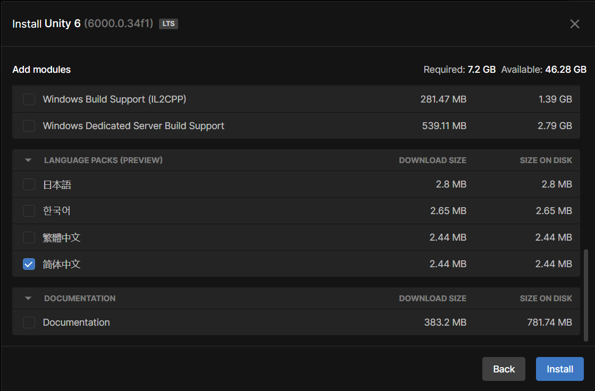

# Unity入门指北
## 零、说在前面
1. Unity的游戏制作需要有编程基础，完全不会编程的话可能会觉得很难上手，非常建议至少学习最基础的C语言或C++入门，能写循环并且对“类”有概念就够了。Unity的编程语言是C#，使用类似C/C++的语法。
2. 通过本教程我希望能让你了解的内容有：


    - 如何下载与安装Unity
    - 如何新建项目（也就是创建一个游戏）
    - 游戏内的元素基本结构是怎样的（GameObject与Component）
    - 如何让角色动起来（位移、旋转与键盘输入）
    - 如何让角色与环境交互（刚体与碰撞，游戏事件）
    - 如何在编辑器里测试游戏（Debug）
    - 如何导出游戏（Build）
    

3. 本教程是以实例为导向，按照教程一步步做下去，你应当能完成一个类似chrome小恐龙的游戏（究极简化版）。
4. 本人也是半自学的Unity，但因为我本身有相当的编程基础，所以没办法用完全小白的视角来讲解。如果有不理解的地方还请谅解。
5. 游戏制作的学习非常建议以目标和实例为导向，而最初的目标可以说是越小越好。一开始能完整地做出个谷歌小恐龙或者flappy bird就很厉害了！等对这个引擎熟悉了，有更多想法了，再考虑查漏补缺，哪里不会学哪里。本教程只会提供最最基础的入门内容。因为Unity本身可以制作各种类型的游戏，从塞尔达like到守望先锋都是理论可行的，所以非常推荐确定想做的游戏类型后再去搜索具体的详细教程。
6. 因为我的Unity是英文的（非常推荐使用英文，因为遇到问题方便搜索），所以很多关键名词会使用英文。
7. 感谢伟大的Alex带孩子入门游戏制作！

## 一、 下载、安装与新建项目
1. 下载：直接在官网下载Unity Hub，地址：[https://unity.com/cn/download](https://unity.com/cn/download)。 它是Unity官方的Unity版本控制和安装工具。Unity本身对独立游戏制作者来说是免费的，具体的收费政策可以在上述网站页面自行查看。需要这篇指南的应该一时半会儿都不会涉及到收费问题，随便用就好。
2. 安装好Unity Hub之后打开，点击左边红框1的位置，会出现如下界面（你的应该是空的）：

3. 此时点击右上的红框2，弹出版本选择窗口。任何标有LTS后缀的版本都是稳定版本，推荐选个4年以内的安装。版本之前区别不会特别大（但也不小），我之后会以Unity6为例来介绍。
4. 点击Install之后会进入这个界面，如果你只打算做windows平台的游戏，直接选好语言安装就可以了；如果你需要做安卓/IOS/MacOS平台的游戏，需要勾选对应的模块后安装（并且考虑换个教程，因为我只做过windows平台）。选好后点击右下角的Install就可以安装了！安装需要一段时间，慢慢等待吧~

5. 安装完成后点击图中左边的红框1，切换到图中界面。此时点击右上的红框2新建项目。


会出现如下界面。中间最上方的红框是选择编辑器版本，下面两个红框是选2D（上）还是3D（下）游戏。要知道的是无论2D还是3D游戏，其界面都是3D的，只是相机视角的不同。我比较常做2D游戏，之后会以2D来讲。
在这个界面右下两个实心红框的位置，红框上面写着“Project name”的地方是项目名，通常就是你的游戏名。下面的红框是保存的位置。选项设置好后点击蓝色按钮“Create Project”创建项目。之后需要等待一段时间，5分钟以上很正常。


## 二、开始做游戏！
### 1. 初始界面介绍：


- 1：场景。可以理解为一个舞台和舞台上的物品，其中比较重要的初始物品是Main Camera（主相机）。
- 2：工具栏。从上到下依次是移动视角、移动物品（xyz轴式移动）、旋转（xyz轴旋转）、缩放、变形，最后一个我基本没用过不重要。
- 3：切换编辑场景和游戏场景的。编辑场景信息更多，游戏场景是游戏启动后实际上能看到的内容。是以相机视野决定的。
- 4：编辑场景，中间的白框就是相机的视野，也就是说白框以外的东西是玩家看不到的。一些游戏的bug就是视野外的物品导致的。
- 5：Assets资源库，你的脚本、预制件、图片和音频等等资源都会存在这个文件夹下，它也可以直接在电脑上找到，就在你项目的文件夹内。
- 6：属性面板，当你在场景中放置一个东西后点击选中，3的位置就会显示它的相关属性，例如图中我在1框选中了“Main Camera”，6框就会显示它的名称等等信息。
- 7：6内的小框，代表一个Component（属性）。例如7框中的属性就是Transform变换，里面的三行从上到下依次是位置、旋转、缩放。里面的数值都是可以填写的，也可以按住X/Y/Z的位置左右拖动，会即时反应在场景内。7框内左上角的小三角点一下可以展开或收起该属性，在属性很多的时候非常有用。

```
值得一提的是如果需要导入资源，建议在Assests文件夹下新建一个名为“Resources”的文件夹（每个字母以及大小写都必须正确），把文件都丢进去，这样可以通过脚本查找。本教程不会用到这个。
```

### 2. 添加游戏对象
- 首先我们需要添加一个物品，也就是所谓的游戏对象（GameObject）。首先右键1处（也就是上图1框内的空白处），按照画线的内容选择，依次是：2D对象 - 精灵（Sprite） - 方块。点击后就会新建一个方块游戏对象。

- 点击后，你的界面会出现一些变化：


- 1是新建游戏对象的名字，可以右键重命名。对象名字可以重复，但不建议重复，在用脚本查找的时候容易出现问题。
- 2是游戏对象在场景内的样子，上面选的是方块所以这里是方块。对象在场景内可以随意拖动，还可以拖拽四角上的蓝色小圈放大缩小。
- 3是Sprite Renderer精灵渲染器，每个Sprite都会有这个东西，有了它，一个Sprite才是可见的。框中第一行Sprite右边就是这个东西的图像。你可以通过从下面Assets库里拖动图片的方式直接替换。
```
- 再往下依次是颜色（本身有图片的情况下会变成叠加效果，建议设置成白色）、翻转XY轴、绘图模式（没问题就别动）、遮盖（制作遮盖动画的时候用，本教程不会需要）、排序点（类似旋转中心点的意思）、材质（美术相关的，我不是很熟），下面可展开的Additional Settings依次是Sorting Layer排序层、Order in Layer层内顺序和Rendering Layer渲染层。这个涉及到遮挡问题。需要展开讲一下：
  Unity内的视野遮挡和z轴无关，只和排序有关。所属的排序层数字大（靠下）的对象会靠玩家更近，会挡住排序层数字更小的。同排序层内的对象按照第二行层内顺序排序，同样是数字大的挡住数字小的。排序层可以在整个界面上方的Edit - Project Setting - Tags and Layers里修改，默认只有Default一层。
```
- 4是Add Component添加属性，属性可以为一个游戏对象提供功能。比如按下某个键就会移动，或和其他物品碰撞就会消失等等。当你按下它，你可以从系统自带的一些脚本里选择添加，也可以直接输入一个文件名来生成新的脚本并附着。

### 3. 添加属性
```
- 这里需要插入一段Unity游戏设计的结构图：
```

```
- 如图所示，一个场景内可以有多个游戏对象，每个游戏对象可以有多个属性，不同的游戏对象之间的属性可以相同。每个属性对应一个脚本，也就是一个Script文件，一段代码（实际上是一个class）。每个脚本内可以有多个变量和函数，负责存储数据和执行功能。
- 实际上前面的Transform、Sprite Renderer都是属性，只是它们是在你创建一个精灵时会自动生成的、系统自带的属性。
- 同个对象下的属性是互相独立的，当然有时候我们需要互相联动，此时需要按照图中的结构来获取，也就是在属性1的脚本里写“获取本属性附着的游戏对象”-“获取该游戏对象上的属性2”-“对属性2的内容进行操作（通常是调用函数）”，具体的代码晚点再说，这里主要是理解结构。
```
- 首先明确，我们添加的这个小方块就是我们操控的角色，也就是相当于chrome小恐龙游戏里的小恐龙，所以我们需要它能实现的功能有：


    1. 按下某个特定按键可以跳起来
    2. 跳起来以后可以自然下落
    3. 碰到障碍会做出反应（死掉）
  
- Unity本身集成了相当强大的物理引擎，所以2可以直接通过添加一个Rigidbody2D刚体属性和一个碰撞器属性来完成。首先点击Add Component，然后在搜索框中输入Rigidbody，如图所示，选择Rigidbody 2D（一定要有2D的那个）

    
- 在新出现的属性里把带红线的部分调成和下图一致。这三个地方从上到下依次是：


  - Collision Detection碰撞检测：离散/连续 ->选择“连续”（对于本教程问题不大，不改也行，但对于非常小的物品来说连续更精准，但消耗更多计算量，可能会使游戏变卡）
  - Sleeping Mode睡眠模式：永不睡眠/保持唤醒/持续睡眠 ->选择“永不睡眠”。选择永不睡眠时，永远对其保持碰撞检测；选择保持唤醒时，只有在这个物品主动运动时检测碰撞；持续睡眠就是不检测。
  - Constraints限制：Freeze Position冻结位移XY和Freeze Rotation冻结旋转Z，这里我们的小方块只需要蹦跳，所以XZ都可以锁上，防止乱跑。
```
RigidBody2D中的其他属性：
- Material材质：和前面精灵渲染的材质不同，这个是指弹性材质。我没怎么用过。
- Simulated模拟：是否参与模拟，不勾选时相当于整个属性不存在（？
- Use Auto Mass：自动判断质量，没用过说实话。
- Mass质量：主要用来模拟碰撞运动和添加力的时候进行计算，F=ma。
- Linear Damping线性阻尼、Angular Damping角度阻尼：类似摩擦力的作用。
- Gravity Scale重力缩放：0表示完全不受重力影响，1表示基本重力（9.8）。其他数值就是按比例了。
- Interpolate插值：根据官方文档的说法是用来计算碰撞抖动效果的，但我没用过，抖动有更多其他的库可以用。
```
- 之后，我们还需要添加一个Box Collider 2D方形碰撞属性，这个属性决定了方块碰撞检测范围的大小和形状。如图所示：

    
- 通过点击“Edit Collider”编辑碰撞器右边的图标，可以显示并更改小方块身上碰撞器的大小，如图所示，方块边缘的绿色线条就是碰撞器的范围（蓝色是我给方块改的颜色）。

- 现在的问题是，因为小方块会自由落体，所以我们需要为它创造一个地面。和创造方块一样我们再次添加一个方形Sprite，然后拖拽四角的蓝色圆圈拉长，并放置在视野下方，如图：

- 这个地板也需要作为刚体参与碰撞，才能托住小方块。但它本身不应该因为碰撞产生任何的运动，所以我们需要为它也添加一个Rigidbody2D和一个box collider 2D。并在Rigidbody中把body type设置成static，如图：

    
  

    Body Type刚体类型：运动/静力/静止。运动指可以受重力、其他碰撞力的影响，也受脚本控制的影响；静力只受脚本中施加力和运动的影响；静止完全不受任何力的影响。

- 现在点击界面上方的播放键，就可以测试小方块的功能2（自由落体）了：

- 方块平稳地落在地板上就是正常，可以点击原先播放按钮位置的停止图标退出游戏。
### 5.添加自定义脚本（属性）
- 现在需要对小方块添加能够跳跃的自定义脚本。添加自定义脚本有两种方式，一种是右键下方Assets文件夹空白位置，选择Create Monobehaviour Script，取名后拖拽到游戏对象的属性面板上，如图所示：

- 另一种是和添加自带的属性一样，点击Add Component按钮。但在搜索框内直接输入脚本名，确认没有重名后按两次回车添加。注意脚本不可以重名，也不可以和自带的属性（也就是脚本）重名。如图所示：

    
→


- 等待编译完成之后双击图中红框位置，打开脚本：

- Unity的时候你已经自动安装了VS(Visual Studio)，所以此时需要等待一下VS启动。启动完成后VS界面如图：

很普通的程序编译器界面，没什么好介绍的，直接看代码。


    - 第一行using UnityEngine是类似C/C++ include的东西，比较常用的还有System.Collections和这俩下属的其他库。如果你复制别人的代码发现找不到某个函数，多半是这里少了声明。
    - 最外层框架public class Movement: Monobehaviour{}：Monobehaviour就是Unity使用的一个非常庞大的类，只有你的脚本所写的东西继承自这个类，它才能附着在游戏对象上。这个类天然和Unity的引擎绑定。
    - 里面的两个函数，void Start()和void Update()。Start是在游戏启动、该脚本加载完成后、调用整个游戏第一帧之前会执行仅一次的函数。一般用作初始化。需要注意的是如果游戏对象在游戏一开始不处于活跃状态，这个函数永远都不会调用；Update是在游戏进行中每一帧都会执行一次的函数。这两个函数由Unity引擎自动调用，只需要往里添加你需要的内容即可，不需要手动调用它们。
    - 需要注意的是，除了using和其他少数一些东西以外，你需要的所有变量和函数都应该写在public class Movement:Monobehaviour的大括号内。
  

- 在start函数前，class的括号后，我们需要添加两个变量：

```c#
    public class Movement : MonoBehaviour
    {
        public float speed;
        public Rigidbody2D body;
        
        ...
    }
```
- - public表示这个变量可以被任何其他脚本访问，与之相关的还有private不可被访问，以及protected只可被该类的子类访问
  - 第一个变量speed是float类型，表示我们跳跃时的速度大小（实际上是力的大小）；
  - 第二个变量body是这个对象上我们前面添加的Rigidbody2D，我们需要通过这个属性来跳跃（施加向上的力）。


- 在start函数里，我们需要添加以下语句：

```c#
    void Start()
    {
        body = GetComponent<Rigidbody2D>();
        if(body == null)
        {
            Debug.LogError("Can't find body!");
        }
    }
```
- - body = GetComponent<Rigidbody2D>();：GetComponent是一个自带的函数，它的完整写法是gameObject.GetComponent<Rigidbody2D>()，意思是从这个脚本所附着的游戏对象（gameObject）上获取一个属性（get component），其属性类型应该是Rigidbody2D。
  - 后面的if语句表示，如果没有成功获取到这个属性（也就是这个body变量为空），就输出提示。和C/C++不同的是，在这里我们没有地方来使用printf输出，而是通过Debug.Log的方式输出调试信息，通过Debug.LogError的方式弹出错误信息。
  - 这一整段的功能就是在游戏一开始，要求这个脚本获取小方块对象上的刚体信息，如果没能成功获取则报错。


- 之后我们需要添加如下内容：
```c#
    void Update()
    {
        if (Input.GetButtonDown("Jump") && transform.position.y <= -3.92)
        {
            Jump();
        }
    }
    public void Jump()
    {
        body.AddForceY(speed, ForceMode2D.Impulse);
    }
```
- - Input.GetButtonDown("Jump")是一个函数，当检测到输入“Jump”键时，它会返回True，否则返回False。“Jump”键是在Unity界面上方菜单中的Edit - Project Setting - Input Manager - Axes里定义的，如图：


  - 因为Unity本身的bug，这里自带的space也就是空格键在Unity里用不了（游戏导出后是正常的），所以我们把它删了改成其他按键，我这里设置成z（小写）。这样当我在游戏内按下z键，Input.GetButtonDown("Jump")就会返回True了。
  - transform.y <= -3.92这一句是为了防止方块在空中无限跳跃的。只有当方块的y坐标小于-3.92（也就是很接近地板的时候）才允许跳跃。
  - if(Input.GetButtonDown("Jump") && transfrom.y <=3.92)，意味着检测到Jump键并且（&&）坐标符合要求（接近地板）时，才执行后续内容，也就是调用Jump()函数


- Jump函数里具体干了什么呢？
  - body也就是前面在start函数里获取过的游戏对象身上的刚体
  - body.AddForceY(speed, ForceMode2D.Impulse)：向body身上施加一个Y方向的力，其力的大小为speed，力的类型为Impulse，也就是一个瞬间的力。力的类型还有另一个是Force，意味着持续的力。
  - 也就是说，每当这个函数被调用，我们就给方块一个瞬间向上的力，让它跳起。这个力的大小由speed决定，方便我们调试。


- 写完后按ctrl+s保存，返回unity界面，等待编译。完成后点击上方的播放键测试游戏，如图所示，按下z键时应该能看到方块跳起再下落，并且在空中不能二段跳：

- 到这里我们角色操控的部分就做完了！接下来要做的是敌人（障碍）的生成和敌人碰撞事件。
