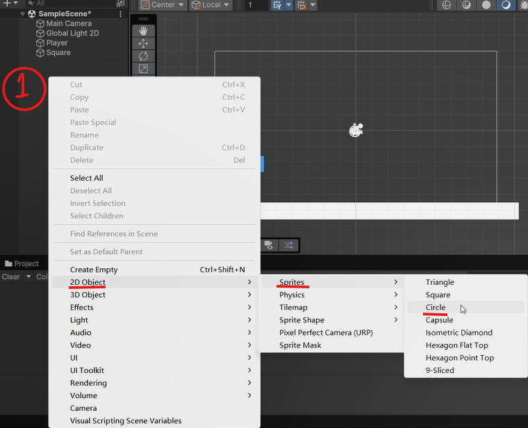
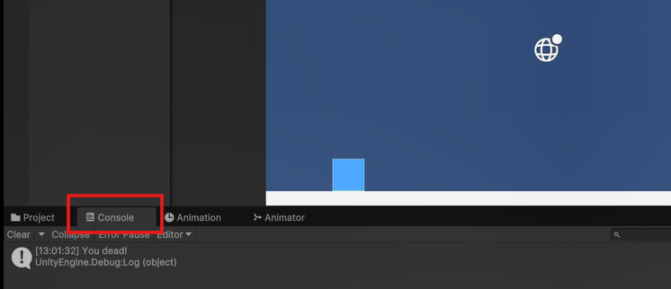
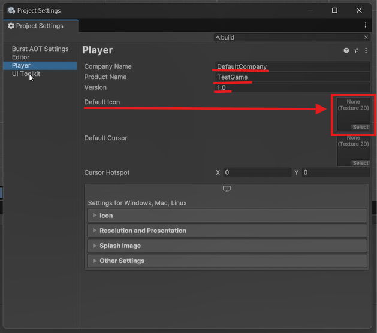

# Unity入门指北
## 零、说在前面
1. Unity的游戏制作需要有编程基础，完全不会编程的话可能会觉得很难上手，非常建议至少学习最基础的C语言或C++入门，能写循环并且对“类”有概念就够了。Unity的编程语言是C#，使用类似C/C++的语法。
2. 通过本教程我希望能让你了解的内容有：


    - 如何下载与安装Unity
    - 如何新建项目（也就是创建一个游戏）
    - 游戏内的元素基本结构是怎样的（GameObject与Component）
    - 如何让角色动起来（位移、旋转与键盘输入）
    - 如何让角色与环境交互（刚体与碰撞，游戏事件）
    - 如何在编辑器里测试游戏（Debug）
    - 如何构建游戏（Build）
    

3. 本教程是以实例为导向，按照教程一步步做下去，你应当能完成一个类似chrome小恐龙的游戏（究极简化版）。
4. 本人也是半自学的Unity，但因为我本身有相当的编程基础，所以没办法用完全小白的视角来讲解。如果有不理解的地方还请谅解。
5. 游戏制作的学习非常建议以目标和实例为导向，而最初的目标可以说是越小越好。一开始能完整地做出个谷歌小恐龙或者flappy bird就很厉害了！等对这个引擎熟悉了，有更多想法了，再考虑查漏补缺，哪里不会学哪里。本教程只会提供最最基础的入门内容。因为Unity本身可以制作各种类型的游戏，从塞尔达like到守望先锋都是理论可行的，所以非常推荐确定想做的游戏类型后再去搜索具体的详细教程。
6. 因为我的Unity是英文的（非常推荐使用英文，因为遇到问题方便搜索），所以很多关键名词会使用英文。
7. 感谢伟大的Alex带孩子入门游戏制作！

## 一、 下载、安装与新建项目
1. 下载：直接在官网下载Unity Hub，地址：[https://unity.com/cn/download](https://unity.com/cn/download)。 它是Unity官方的Unity版本控制和安装工具。Unity本身对独立游戏制作者来说是免费的，具体的收费政策可以在上述网站页面自行查看。需要这篇指南的应该一时半会儿都不会涉及到收费问题，随便用就好。
2. 安装好Unity Hub之后打开，点击左边红框1的位置，会出现如下界面（你的应该是空的）：


    
   
3. 此时点击右上的红框2，弹出版本选择窗口。任何标有LTS后缀的版本都是稳定版本，推荐选个4年以内的安装。版本之间区别不会特别大（但也不小），我之后会以Unity6为例来介绍。
4. 点击Install之后会进入这个界面，如果你只打算做windows平台的游戏，直接选好语言安装就可以了；如果你需要做安卓/IOS/MacOS平台的游戏，需要勾选对应的模块后安装（并且考虑换个教程，因为我只做过windows平台）。选好后点击右下角的Install就可以安装了！安装需要一段时间，慢慢等待吧~


    

5. 安装完成后点击图中左边的红框1，切换到图中界面。此时点击右上的红框2新建项目。


   


会出现如下界面。中间最上方的红框是选择编辑器版本，下面两个红框是选2D（上）还是3D（下）游戏。要知道的是无论2D还是3D游戏，其界面都是3D的，只是相机视角的不同。我比较常做2D游戏，之后会以2D来讲。
在这个界面右下两个实心红框的位置，红框上面写着“Project name”的地方是项目名，通常就是你的游戏名。下面的红框是保存的位置。选项设置好后点击蓝色按钮“Create Project”创建项目。之后需要等待一段时间，5分钟以上很正常。
    
    


## 二、开始做游戏！
### 1. 初始界面介绍：


- 1：场景。可以理解为一个舞台和舞台上的物品，其中比较重要的初始物品是Main Camera（主相机）。
- 2：工具栏。从上到下依次是移动视角、移动物品（xyz轴式移动）、旋转（xyz轴旋转）、缩放、变形，最后一个我基本没用过不重要。
- 3：切换编辑场景和游戏场景的。编辑场景信息更多，游戏场景是游戏启动后实际上能看到的内容。是以相机视野决定的。
- 4：编辑场景，中间的白框就是相机的视野，也就是说白框以外的东西是玩家看不到的。一些游戏的bug就是视野外的物品导致的。
- 5：Assets资源库，你的脚本、预制件、图片和音频等等资源都会存在这个文件夹下，它也可以直接在电脑上找到，就在你项目的文件夹内。
- 6：属性面板，当你在场景中放置一个东西后点击选中，3的位置就会显示它的相关属性，例如图中我在1框选中了“Main Camera”，6框就会显示它的名称等等信息。
- 7：6内的小框，代表一个Component（属性）。例如7框中的属性就是Transform变换，里面的三行从上到下依次是位置、旋转、缩放。里面的数值都是可以填写的，也可以按住X/Y/Z的位置左右拖动，会即时反应在场景内。7框内左上角的小三角点一下可以展开或收起该属性，在属性很多的时候非常有用。

```
值得一提的是如果需要导入资源，建议在Assests文件夹下新建一个名为“Resources”的文件夹（每个字母以及大小写都必须正确），把文件都丢进去，这样可以通过脚本查找。本教程不会用到这个。
```

### 2. 添加游戏对象
- 首先我们需要添加一个物品，也就是所谓的游戏对象（GameObject）。首先右键1处（也就是上图1框内的空白处），按照画线的内容选择，依次是：2D对象 - 精灵（Sprite） - 方块。点击后就会新建一个方块游戏对象。


    

  
- 点击后，你的界面会出现一些变化：


    


- 1是新建游戏对象的名字，可以右键重命名。对象名字可以重复，但不建议重复，在用脚本查找的时候容易出现问题。
- 2是游戏对象在场景内的样子，上面选的是方块所以这里是方块。对象在场景内可以随意拖动，还可以拖拽四角上的蓝色小圈放大缩小。
- 3是Sprite Renderer精灵渲染器，每个Sprite都会有这个东西，有了它，一个Sprite才是可见的。框中第一行Sprite右边就是这个东西的图像。你可以通过从下面Assets库里拖动图片的方式直接替换。
```
- 再往下依次是颜色（本身有图片的情况下会变成叠加效果，建议设置成白色）、翻转XY轴、绘图模式（没问题就别动）、遮盖（制作遮盖动画的时候用，本教程不会需要）、排序点（类似旋转中心点的意思）、材质（美术相关的，我不是很熟），下面可展开的Additional Settings依次是Sorting Layer排序层、Order in Layer层内顺序和Rendering Layer渲染层。这个涉及到遮挡问题。需要展开讲一下：
  Unity内的视野遮挡和z轴无关，只和排序有关。所属的排序层数字大（靠下）的对象会靠玩家更近，会挡住排序层数字更小的。同排序层内的对象按照第二行层内顺序排序，同样是数字大的挡住数字小的。排序层可以在整个界面上方的Edit - Project Setting - Tags and Layers里修改，默认只有Default一层。
```
- 4是Add Component添加属性，属性可以为一个游戏对象提供功能。比如按下某个键就会移动，或和其他物品碰撞就会消失等等。当你按下它，你可以从系统自带的一些脚本里选择添加，也可以直接输入一个文件名来生成新的脚本并附着。

### 3. 添加属性
```
- 这里需要插入一段Unity游戏设计的结构图：
```

```
- 如图所示，一个场景内可以有多个游戏对象，每个游戏对象可以有多个属性，不同的游戏对象之间的属性可以相同。每个属性对应一个脚本，也就是一个Script文件，一段代码（实际上是一个class）。每个脚本内可以有多个变量和函数，负责存储数据和执行功能。
- 实际上前面的Transform、Sprite Renderer都是属性，只是它们是在你创建一个精灵时会自动生成的、系统自带的属性。
- 同个对象下的属性是互相独立的，当然有时候我们需要互相联动，此时需要按照图中的结构来获取，也就是在属性1的脚本里写“获取本属性附着的游戏对象”-“获取该游戏对象上的属性2”-“对属性2的内容进行操作（通常是调用函数）”，具体的代码晚点再说，这里主要是理解结构。
```
- 首先明确，我们添加的这个小方块就是我们操控的角色，也就是相当于chrome小恐龙游戏里的小恐龙，所以我们需要它能实现的功能有：


    1. 按下某个特定按键可以跳起来
    2. 跳起来以后可以自然下落
    3. 碰到障碍会做出反应（死掉）
  
- Unity本身集成了相当强大的物理引擎，所以2可以直接通过添加一个Rigidbody2D刚体属性和一个碰撞器属性来完成。首先点击Add Component，然后在搜索框中输入Rigidbody，如图所示，选择Rigidbody 2D（一定要有2D的那个）


    

  
- 在新出现的属性里把带红线的部分调成和下图一致。这三个地方从上到下依次是：

  
    

  - Collision Detection碰撞检测：离散/连续 ->选择“连续”（对于本教程问题不大，不改也行，但对于非常小的物品来说连续更精准，但消耗更多计算量，可能会使游戏变卡）
  - Sleeping Mode睡眠模式：永不睡眠/保持唤醒/持续睡眠 ->选择“永不睡眠”。选择永不睡眠时，永远对其保持碰撞检测；选择保持唤醒时，只有在这个物品主动运动时检测碰撞；持续睡眠就是不检测。
  - Constraints限制：Freeze Position冻结位移XY和Freeze Rotation冻结旋转Z，这里我们的小方块只需要蹦跳，所以XZ都可以锁上，防止乱跑。
```
RigidBody2D中的其他属性：
- Material材质：和前面精灵渲染的材质不同，这个是指弹性材质。我没怎么用过。
- Simulated模拟：是否参与模拟，不勾选时相当于整个属性不存在（？
- Use Auto Mass：自动判断质量，没用过说实话。
- Mass质量：主要用来模拟碰撞运动和添加力的时候进行计算，F=ma。
- Linear Damping线性阻尼、Angular Damping角度阻尼：类似摩擦力的作用。
- Gravity Scale重力缩放：0表示完全不受重力影响，1表示基本重力（9.8）。其他数值就是按比例了。
- Interpolate插值：根据官方文档的说法是用来计算碰撞抖动效果的，但我没用过，抖动有更多其他的库可以用。
```
- 之后，我们还需要添加一个Box Collider 2D方形碰撞属性，这个属性决定了方块碰撞检测范围的大小和形状。如图所示：


    
- 通过点击“Edit Collider”编辑碰撞器右边的图标，可以显示并更改小方块身上碰撞器的大小，如图所示，方块边缘的绿色线条就是碰撞器的范围（蓝色是我给方块改的颜色）。

  
    

  
- 现在的问题是，因为小方块会自由落体，所以我们需要为它创造一个地面。和创造方块一样我们再次添加一个方形Sprite，然后拖拽四角的蓝色圆圈拉长，并放置在视野下方，如图：

  
    
- 这个地板也需要作为刚体参与碰撞，才能托住小方块。但它本身不应该因为碰撞产生任何的运动，所以我们需要为它也添加一个Rigidbody2D和一个box collider 2D。并在Rigidbody中把body type设置成static，如图：

    
  

    Body Type刚体类型：运动/静力/静止。运动指可以受重力、其他碰撞力的影响，也受脚本控制的影响；静力只受脚本中施加力和运动的影响；静止完全不受任何力的影响。

- 现在点击界面上方的播放键，就可以测试小方块的功能2（自由落体）了：

  
    

    

  
- 方块平稳地落在地板上就是正常，可以点击原先播放按钮位置的停止图标退出游戏。
### 4.添加自定义脚本（属性）
- 现在需要对小方块添加能够跳跃的自定义脚本。添加自定义脚本有两种方式，一种是右键下方Assets文件夹空白位置，选择Create Monobehaviour Script，取名后拖拽到游戏对象的属性面板上，如图所示：

  
    


- 另一种是和添加自带的属性一样，点击Add Component按钮。但在搜索框内直接输入脚本名，确认没有重名后按两次回车添加。注意脚本不可以重名，也不可以和自带的属性（也就是脚本）重名。如图所示：

    →

- 等待编译完成之后双击图中红框位置，打开脚本：

  
    

  
- Unity的时候你已经自动安装了VS(Visual Studio)，所以此时需要等待一下VS启动。启动完成后VS界面如图：

  
    

  
很普通的程序编译器界面，没什么好介绍的，直接看代码。


    - 第一行using UnityEngine是类似C/C++ include的东西，比较常用的还有System.Collections和这俩下属的其他库。如果你复制别人的代码发现找不到某个函数，多半是这里少了声明。
    - 最外层框架public class Movement: Monobehaviour{}：Monobehaviour就是Unity使用的一个非常庞大的类，只有你的脚本所写的东西继承自这个类，它才能附着在游戏对象上。这个类天然和Unity的引擎绑定。
    - 里面的两个函数，void Start()和void Update()。Start是在游戏启动、该脚本加载完成后、调用整个游戏第一帧之前会执行仅一次的函数。一般用作初始化。需要注意的是如果游戏对象在游戏一开始不处于活跃状态，这个函数永远都不会调用；Update是在游戏进行中每一帧都会执行一次的函数。这两个函数由Unity引擎自动调用，只需要往里添加你需要的内容即可，不需要手动调用它们。
    - 需要注意的是，除了using和其他少数一些东西以外，你需要的所有变量和函数都应该写在public class Movement:Monobehaviour的大括号内。
  

- 在start函数前，class的括号后，我们需要添加两个变量：

```c#
    public class Movement : MonoBehaviour
    {
        public float speed;
        public Rigidbody2D body;
        
        ...
    }
```
- - public表示这个变量可以被任何其他脚本访问，与之相关的还有private不可被访问，以及protected只可被该类的子类访问
  - 第一个变量speed是float类型，表示我们跳跃时的速度大小（实际上是力的大小）；
  - 第二个变量body是这个对象上我们前面添加的Rigidbody2D，我们需要通过这个属性来跳跃（施加向上的力）。


- 在start函数里，我们需要添加以下语句：

```c#
    void Start()
    {
        body = GetComponent<Rigidbody2D>();
        if(body == null)
        {
            Debug.LogError("Can't find body!");
        }
    }
```
- - body = GetComponent<Rigidbody2D>();：GetComponent是一个自带的函数，它的完整写法是gameObject.GetComponent<Rigidbody2D>()，意思是从这个脚本所附着的游戏对象（gameObject）上获取一个属性（get component），其属性类型应该是Rigidbody2D。
  - 后面的if语句表示，如果没有成功获取到这个属性（也就是这个body变量为空），就输出提示。和C/C++不同的是，在这里我们没有地方来使用printf输出，而是通过Debug.Log的方式输出调试信息，通过Debug.LogError的方式弹出错误信息。
  - 这一整段的功能就是在游戏一开始，要求这个脚本获取小方块对象上的刚体信息，如果没能成功获取则报错。


- 之后我们需要添加如下内容：
```c#
    void Update()
    {
        if (Input.GetButtonDown("Jump") && transform.position.y <= -3.92f)
        {
            Jump();
        }
    }
    public void Jump()
    {
        body.AddForceY(speed, ForceMode2D.Impulse);
    }
```
- - Input.GetButtonDown("Jump")是一个函数，当检测到输入“Jump”键时，它会返回True，否则返回False。“Jump”键是在Unity界面上方菜单中的Edit - Project Setting - Input Manager - Axes里定义的，如图：


    

  - 因为Unity本身的bug，这里自带的space也就是空格键在Unity里用不了（游戏导出后是正常的），所以我们把它删了改成其他按键，我这里设置成z（小写）。这样当我在游戏内按下z键，Input.GetButtonDown("Jump")就会返回True了。
  - transform.y <= -3.92f这一句是为了防止方块在空中无限跳跃的。只有当方块的y坐标小于-3.92（也就是很接近地板的时候）才允许跳跃。f是float的标志，在Unity中使用float格式的小数（浮点数）需要以f标出，可以理解为通常小数都需要加一个f。
  - if(Input.GetButtonDown("Jump") && transfrom.y <=3.92)，意味着检测到Jump键并且（&&）坐标符合要求（接近地板）时，才执行后续内容，也就是调用Jump()函数


- Jump函数里具体干了什么呢？
  - body也就是前面在start函数里获取过的游戏对象身上的刚体
  - body.AddForceY(speed, ForceMode2D.Impulse)：向body身上施加一个Y方向的力，其力的大小为speed，力的类型为Impulse，也就是一个瞬间的力。力的类型还有另一个是Force，意味着持续的力。
  - 也就是说，每当这个函数被调用，我们就给方块一个瞬间向上的力，让它跳起。这个力的大小由speed决定，方便我们调试。


- 写完后按ctrl+s保存，返回unity界面，等待编译。完成后在属性面板的Movement脚本处将Speed改为10，如图所示：


点击上方的播放键测试游戏，如图所示，按下z键时应该能看到方块跳起再下落，并且在空中不能二段跳：


- 到这里我们角色操控的部分就做完了！接下来要做的是敌人（障碍）的生成和敌人碰撞事件。

### 5. 添加敌人（障碍）

- 首先明确一下，敌人应该有以下功能：
    1. 如果没有其他干扰，则保持水平向左前进
    2. 可以和角色碰撞，并触发碰撞事件

- 为了和小方块区分，我们添加一个圆形作为敌人，并把它调成红色（小方块的蓝色也是一样的改法）。如图所示：





 → 

- 之后我们需要为敌人添加运动状态。我希望敌人从屏幕右边、视野外侧水平向左飞来，如果没有被角色碰到，则一路飞离视野范围。也就是说，敌人需要持续匀速地在X方向上运动，YZ方向不变，可以用Update函数来完成。首先添加一个自定义的属性EnemyMovement，如图：


- 双击打开脚本后，在Update函数里添加以下内容：

```c#
    void Update()
    {
        transform.position = transform.position + Vector3.left * speed * Time.deltaTime;
    }
```

- - transform就是前面界面介绍的时候提到过的游戏对象的位置和旋转信息
  - transform.position就是对象的位置信息，它的类型是一个3维的向量（Vector3），三个值分别是xyz轴的坐标
  - Vecotr3.left = Vecotr3(-1,0,0)，也就是x方向上-1
  - Vecotr3.left * speed * Time.deltaTime就是这一帧内敌人需要移动的距离（Time.deltaTime可以简单理解为这一帧的时间）
  - 这一整句的意思就是，在当前位置的基础上向左移动一个speed*Time.deltaTime的距离

```
- deltaTime是游戏开发中很重要的一个概念，所以插入一点对于Time.deltaTime的讲解：
- deltaTime是游戏从上一帧到这一帧所经过的时间，用于估计这一帧需要消耗的时间。比如我们经常说的游戏帧率30帧/秒，对应的delta time就是1/30秒。由于游戏每一帧刷新时需要调用所有活跃对象的Update函数和其他正在进行中的子线程并进行渲染，而它们的计算量每次又不一定相同，所以刷新每一帧所消耗的时间是不同的，也就是说delta time并不是一个不变的值。哪怕是锁定帧率上限，它也会浮动，这点可以从一些显示帧率的游戏中看出来，哪怕是锁60帧，帧率也会在55~65中间浮动，这是非常正常的。
- 在我们所设计的敌人运动中，这一帧前进的距离=速度*这一帧的时长，速度是由我们设置的speed决定的，而时间就是以Time.deltaTime来计算的（实际上是以前一帧的计算时间来估计这一帧的计算时间）。
```

- 接下来需要添加敌人的碰撞事件。在碰撞发生时，Unity会自动调用名为OnTriggerEnter2D或OnCollisionEnter2D的函数，它是从MonoBehaviour继承来的，和Start以及Update一样，我们只需要为它添加内容即可。在Update后添加如下内容：
```c#
    public void OnTriggerEnter2D(Collider2D collision)
    {
        gameObject.SetActive(false);
        collision.gameObject.GetComponent<Movement>().Die();
    }
```
- - 此函数传入的参数collision是“与该对象碰撞的对象（的Collider2D属性）”，在这里相当于小方块身上的Box Collider 2D属性
  - gameObject就是指“该脚本所附着的游戏对象”
  - gameObject.SetActive(false)意思是把该游戏对象的活跃状态设置成false（否），也就是不活跃，在游戏内就相当于删除了
  - collision.gameObject是获取“与该对象碰撞的对象”，在这个游戏中相当于小方块的游戏对象
  - GetComponent<Movement>().Die()，获取小方块身上的Movement属性，并调用其中（声明为public公用的）Die函数
    - Die函数我们暂时还没写，等下再回去添加

```
OnTriggerEnter2D和OnCollisionEnter2D两个函数的区别会在后面为敌人添加Collider属性的时候一并解释。
```

- 完成后保存并切换到Unity界面，等待编译完成。在敌人的EnemyMovement属性中，将参数改为5，如图：


### 6. 为敌人添加刚体和碰撞器
- 和小方块类似，敌人也需要添加刚体和碰撞器属性才能参与碰撞检测，添加方法也和小方块类似，如图，首先添加Rigidbody2D，修改图中画线部分的参数：


- - 修改的内容在前面修改小方块时已经介绍过，这里不再赘述

- 因为我们的敌人是圆形的，所以碰撞器也应该是圆形的，如图所示添加一个Circle Collider 2D:


- 检查碰撞器范围（图中绿线）：


- 与小方块与地板之间的实体碰撞不同，我们不希望敌人对小方块的运动状态产生任何影响，因此可以把敌人的is Trigger属性勾选：


```
- 当勾选is Trigger属性时，脚本中的碰撞事件需要使用OnTrigger系列（OnTriggerEnter2D, OnTriggerExit2D, OnTriggerStay2D）；不勾选时，碰撞事件使用OnCollision系列（OnCollisionEnter2D...）
- 当勾选is Trigger属性时，它相当于一个非实体，它与其他游戏对象的碰撞不会对双方产生任何运动上的影响，但会触发OnTrigger的事件。比如把子弹设置成Trigger就不会对角色产生冲击力，但可以对角色造成伤害。
```
- 之后需要在主界面中将敌人放置在小方块落地后水平方向能够碰撞到的位置，但放在白色相机框（视野区域）以外的右侧，如图：


### 7. 为角色设置碰撞事件
- 在5.添加敌人的部分，我们在代码中要求碰撞时调用角色身上的Die函数，但这个函数我们还没写，现在补上。
- 在角色被敌人撞到时，从角色的角度我们希望角色能够停止运动，也不再接收任何输入，或者说直接让游戏停止。这些可以写在Die函数里。
- 再次打开小方块身上的Movement脚本，在Jump函数后添加以下函数：

```c#
    public void Die()
    {
        Debug.Log("You dead!");
        Time.timeScale = 0;
    }
```

- - Debug.Log()是前面提到过的提示信息，在导出游戏后不会出现，仅在Unity编辑器里可以看到
  - Time.timeScale是Unity内置的时间缩放，默认值为1（一倍时间），设置成0就相当于冻结时间。也可以设置为其他值比如0.5、3来调整时间。部分游戏的子弹时间就是用这个做的（但严格来说比较建议手动设置一个时间缩放，因为这个有时候还是挺坑的……）
- 这样，在敌人与小方块碰撞后，首先Unity会自动调用敌人的OnTriggerEnter2D函数，敌人变为非活跃，随后立即调用小方块身上的Die函数，输出调试信息并冻结时间。
- 保存后切换到Unity，点击红框位置，把主界面下面的窗口切换到Console（控制台），也就是输出调试或错误信息的地方。之后点击上方播放键测试一下，在碰撞后能看到出现调试信息，敌人也消失就是没有问题，如图：




### 8. 设置敌人生成器
- 在游戏中，我们显然不能只有这一个敌人。但手动做上百个敌人又并不现实。考虑到小圆球可以重复利用，我们可以制作一个Spawner生成器。
- 首先我们需要把刚才制作好的敌人做成Prefab预制件，这样它就会被储存到本地文件中，可以通过脚本重复生成。可以理解为制作了一个模具，之后可以用它来复制出很多个一模一样的敌人。制作预制件的方法很简单，首先点击下方窗口的Project（红框1），切换到资源库界面，再单击左边的Assets文件夹（红框2），此时红框3中应该如图所示显示Assets：


- 之后拖拽左上游戏对象列表中的Enemy（或主界面中的小圆球）到下方空白处，也就是把下图中的1或3拖动到2处放手：


- 随后就可以看到资源库内多出了一个蓝色立方体，名为Enemy，如图：


- 这个立方体Enemy（也可能随后显示为小圆球）就是一个预制件，可以通过脚本重复生成啦！如果你单击这个预制件，就会发现右边属性面板里它拥有和主界面中的敌人一模一样的属性。

```
但如果对现在存在在主界面中的敌人进行更改，不会立即反应在预制件中，若想在制作预制件后进行更改，请双击资源库中的预制件更改，也可以更改主界面中的敌人后在属性面板右上方点击Override - Override All；若想让预制件覆盖更改后的主界面中的敌人，请点击Override - Revert All
```

- 接下来需要放置一个生成器游戏对象，因为后续我们需要生成的脚本必须要挂载在游戏对象上才有效。因为生成器只需要存在而不需要任何可见性，所以直接添加一个空游戏对象即可，如图：


- 将其重命名为EnemySpawner，并添加自定义脚本“Spawner”后打开，把代码修改成如下：
```c#
using UnityEngine;
using System.Collections;

public class Spawner : MonoBehaviour
{
    public GameObject Enemy;
    private Coroutine spawnVar;

    void Start()
    {
        spawnVar = StartCoroutine(spawnCO());
    }

    public IEnumerator spawnCO()
    {
        while (true)
        {
            GameObject newEnemy = Instantiate(Enemy, transform);
            newEnemy.transform.localPosition = Vector3.zero;
            yield return new WaitForSeconds(Random.Range(2, 5));
        }
    }
    public void stopSpawn()
    {
        StopCoroutine(spawnVar);
    }
}
```
-先说IEnumerator spawnCO()这个函数相关的内容：
  - 第二行添加的using System.Collections是包含了IEnumerator的库。IEnumerator是迭代器，可以理解为是一个子线程
  - 首先里面有一个永远循环的while，在while里我们先执行了两个操作语句，之后yield return new WaitForSeconds(...)。new WaitForSeconds()代表一个延时，函数内的参数是float或int，代表延时的时长（以秒为单位）。yield return xxx就是指暂时跳出子线程并返回一个延时。
  - Random.Range(2,5)是一个简单的随机数，意味着生成[2,5)之间的随机整数，注意这是一个左闭右开的区间，意味着生成的随机数只可能是2、3、4中的一个。
  ```
  传入的参数也可以是小数（float），此时区间为左闭右闭，即两头都包括。
  只要其中一个参数是float，就会以float模式计算。
  ```
  - 如果上面的解释都没有看懂，没有关系，你需要知道的是下面这个函数
  ```c#
  public IEnumerator spawnCO()
    {
        while (true)
        {
            ... //语句
            yield return new WaitForSeconds(n);
        }
    }
  ```
  会产生一个无限循环执行“执行语句”-“等待n秒”的、平行于主进程的子进程就可以了。
  - 那么在while循环里我们究竟执行了什么？首先我们使用Instantiate函数创建了一个Enemy的实例（请注意目前为止这个Enemy不等于我们在Unity里的Enemy，因为它是这个脚本中Start函数上面两行所定义的Enemy变量），也就是用Enemy这个模板复制出了一个敌人，其transform parent是这个脚本所附着的对象（也就是Unity中的EnemySpawner），这意味着敌人的坐标原点位于脚本附着的对象中心。
  - 这个复制出的敌人被我们赋值给一个新建的游戏对象newEnemy。之后对newEnemy的transform进行更改，也就是对刚才复制出来的敌人位置进行更改。
  - transform.localPosition是本地坐标，也就是相对于它的transform parent，它的坐标为多少。如果不使用transform.localPosition而是使用和前面小方块一样的transform.position，则需要根据全局坐标系来设置数值。这里不展示写法了。
  - 也就是说，“newEnemy.transform.localPosition = Vector3.zero;”这一句指令，把新复制出的敌人相对于EnemySpawner的坐标改为Vector3.zero（即(0,0,0)）。
  - 总体来说，这个IEnumerator完成了怎样的任务呢？它每隔2~4秒就在EnemySpawner的位置生成一个Enemy。这个Enemy具有和我们之前制作的、会向左前进、会碰撞并产生碰撞事件的敌人具有完全相同的属性（除了坐标被限定）。

- 接下来再来说Start函数里相关的内容：
  - 在Start上面，我们创建了一个私有变量（private），其类型为Coroutine（进程），其变量名为spawnCOVar
  - 在Start函数里，我们使用Unity自带的StartCoroutine()函数开启了前面提到的spawnCO线程，并把这个线程“打包”赋值给了spawnCOVar，也就是说之后如果对spawnCOVar进行操作等价于对线程spawnCO进行操作。

- 最后说stopSpawn()这个函数：
  - 当这个函数被调用时，会通过Unity自带的StopCoroutine()函数来终止线程，被终止的线程就是spawnCOVar所代表的spawnCO线程。也就是说当这个函数被调用时，一开始提到的每隔几秒钟产生一个敌人的线程就会被掐掉不再执行（没错while也会被强制掐掉）。

- 万一你前面全都没看懂：这个脚本需要一个预制件作为模板，在游戏开始后就会每隔2~4秒复制一个预制件出来。当需要停止时就调用它的stopSpawn函数。

- 保存后切换到Unity，等待编译完成，之后把Assets里的Enemy预制件拖放到右边属性面板里Spawner属性下的Enemy处，如图，按住红圈1处拖动到红框2处松开，也就是把之前做的预制件敌人指定为这个脚本生成的模板：


- 接下来我们希望在小方块撞到敌人后停止敌人的生成。
```
实际上Time.timeScale设置为0后，敌人已经不会生成了。这里只是展示一下stopSpawn()函数的用法。
```
- 再次回到小方块的Movement脚本处，在Start函数上方变量定义处添加一行：
```c#
public Spawner spawner;
```
- 再把Die()修改一下：
```c#
public void Die()
{
    Debug.Log("You dead!");
    Time.timeScale = 0;
    spawner.stopSpawn();
}
```
- 也就是添加括号里的最后一行，调用stopSpawn()函数。
- 保存之后返回Unity界面，把左侧游戏对象列表里的EnemySpawner拖动到小方块Movement里新出现的参数“spawner”上。之后点击EnemySpawner，再点击工具栏中的十字箭头（移动），拖动坐标轴把EnemySpawner移动到原先的小圆形位置：


- 再点击左侧的Enemy，按delete键将其删除。之后就可以点击播放测试游戏了。如图所示，每隔几秒钟会从屏幕右边飞来一个红色圆球：


- 到这里为止，我们的游戏就算做完了。你可以继续往上添加任何你想要的内容，比如添加UI-Text来显示死亡提示、添加“开始游戏”按钮……这些都可以随意尝试，网上也有大量相关的教程，在此不一一介绍了。接下来是游戏导出的部分。
## 三、导出游戏！
### 1. 设置脚本顺序
- 说实话这个不是必要的，但我非常非常建议大家手动设置脚本生成顺序，也非常建议大家一边写脚本就一边设置顺序，以免自己写了百八十个脚本之后根本不知道应该安排谁先谁后。（问就是被坑过）
- 脚本顺序指的是脚本执行的顺序。假设我们有脚本A和脚本B，其中A一执行就需要调用B的某个参数，而B本身对A没有调用。如果Unity在编译时先执行脚本A，再执行脚本B，那么脚本A就可能会报错，因为此时脚本B甚至还没有初始化，参数不存在，这就会导致游戏出现错误（bug）。因此我们希望强制安排好脚本执行的先后顺序，把不需要调用其他脚本的脚本排在前面，把对其他脚本依赖性很强的脚本排在后面。

- 首先点击主界面左上的Edit - Project Settings，点击左侧的Script Execution Order，获得如下窗口，此时点击图中红框位置的加号：


- 会弹出三个脚本名，我们按EnemyMovement - Spawner - Movement的顺序添加，如图：


- 添加后你的界面应该会变成这样：


- 如果顺序排错了，可以上下拖动脚本名前面的三横排序，即图中红框位置：


- 最后没问题了就点击窗口右下的Apply，等待编译完成。


### 2. 设置游戏图标和其他信息
- Unity可以设置生成的游戏文件信息，就在刚才打开的窗口（Edit - Project Settings）里。点击左侧Player行，窗口显示应当如图所示：




- 画线的三行从上到下依次是公司名（制作组/者名）、游戏名和游戏版本。红框位置点击后可以设置游戏.exe文件的图标。
- 下方的四个小三角中，如图，icon行展开可以为不同系统、不同尺寸设置不同的图标；Resolution and Presentation展开可以设置分辨率相关的内容；Splash Image可以设置启动动画；Other Setting可以设置色彩空间等等。可以自己设置看看。


- 设置完成后就可以点击窗口右上的×关掉窗口。

### 3. 设置构建（Build）信息并导出游戏

- 点击主界面左上的File - Build Profiles打开构建设置（也就是导出成可以游玩的游戏的设置），如图：


- - 上图中左边画横线的地方表示构建目标平台为Windows，如果你在前面安装时选择了其他平台的包，也可以构建至其他平台
  - 中间靠上的红框Scene List列出了可构建的场景。由于我们只有一个场景，这里会被强制选择。如果你有多个场景，则可以选择只构建一部分。
  - 中间靠下的红框是比较重要的，其中第一行Development Build表示以调试模式构建，勾选状态下构建时，如果你的游戏报错（Debug.LogError），则会显示在游戏中，方便调试。当第一行勾选时，后续三行也会变为可选状态，但三行说实话我都没用到过，全不选就好。
  - 右上的小红框以及小红框边上的两个按钮比较重要。上面的Build And Run就是构建后自动打开程序，左边的Build就是单纯构建，不自动打开程序。红框的小三角点开可以看到如图两个选项：


  


- - Clean Build是指首先清空文件夹内之前构建时产生的文件再构建，如果你前后构建了很多次，构建时会有一些文件被重复利用以缩短时间。但这有可能导致某些数据没有被更新。所以如果你构建后发现有问题需要重复构建，推荐使用Clean Build（代价是构建速度会慢一些）。
  - Force skip data build是和前面相反的，强制跳过除代码外的数据来构建（例如图片和音频数据）。当你额外数据比较大又没有改动的时候可以选择这个来缩短构建时间。

- 无论选择哪一种构建方式，你都会需要选择一个文件夹来保存构建的文件。确定好地址后只要等待（漫长的）构建过程就可以了。
```
如果不是第一次构建，在选择非clean build的构建方式时，不需要选择构建文件夹，会自动构建在之前的文件夹中。
```
- 构建完成后，你的本地文件夹里会有大差不差这些文件：


- 其中红框圈起来的就是游玩时需要打开的程序。但请注意，向别人发送游戏的时候整个文件包都必须一起发送，一旦里面文件的相对位置移动就不能保证游戏的正常运行。一般直接把整个文件夹打成压缩包上传云盘或发送就好。

## 四、最后想说的话！
- 恭喜你！现在已经完成了你的第一个游戏！怎么样，觉得有难度吗？理解了吗？有哪里不会的或者发现哪里有错误欢迎在issue里向我留言！
- Unity的功能实在是非常之多也非常之杂，单凭这篇指南只能说勉强知道有哪些操作而已。还是和开头所说的一样，如果想要学习更多Unity的内容，非常非常建议以目标为导向，也就是先想好要做一个怎样的游戏，有哪些场景元件，需要实现哪些功能，再根据想法上手去做，遇到不会的就去搜索。Unity官方文档作为新手可能很难看懂，比较推荐的是查找一些带有实例的函数用法。在必要的时候也可以去问ChatGPT老师，但如果你想真正理解你的游戏，还请不要让ChatGPT直接为你完成代码。更推荐的方式是让它给出一个你所需要函数的用法实例，再结合Unity的官方文档理解。
- 本篇并没有涉及到UI相关的内容，但UI也是我个人觉得不太好上手的部分，所以有可能的话（咕咕！）会再写一篇UI相关的介绍。
- 总之，祝大家搓游戏愉快！玩游戏也愉快！
